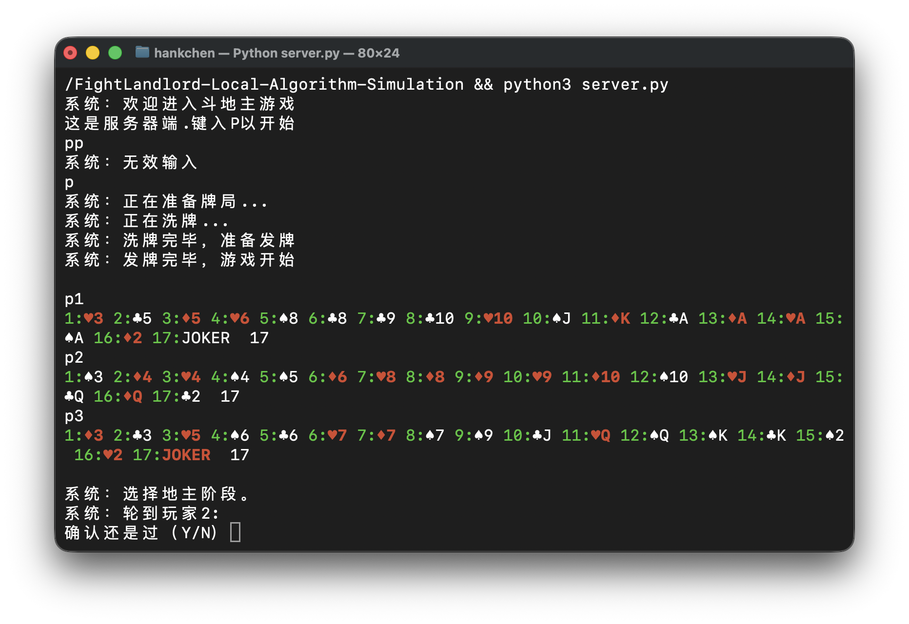

# 斗地主本地算法模拟

一个使用 Python 实现的斗地主规则与回合流程模拟，重点展示发牌、牌型识别、合法出牌比较和胜负判断。

[English](README_EN.md)

## 项目概述

项目以算法模型而非图形界面为核心：创建 54 张牌、为三位玩家发牌、选择地主、识别常见牌型、比较当前出牌与桌面牌，并推进出牌/过牌与回合重置。

## 截图



截图直接来自 `server.py` 的真实终端运行。该仓库本身没有图形化游戏界面。

## 核心能力

- 54 张牌与三人发牌流程
- 单张、对子、三张、顺子、炸弹、火箭等牌型识别
- 与上一手牌的合法性和大小比较
- 地主/农民角色与回合状态管理
- 过牌、重新领出与胜负判断

## 运行

```bash
python3 server.py
```

## 当前范围

当前可验证产品边界是本地终端算法模拟。`client.py` 中的网络客户端入口尚不完整，因此本文档不将项目描述为可用的联网斗地主产品。
